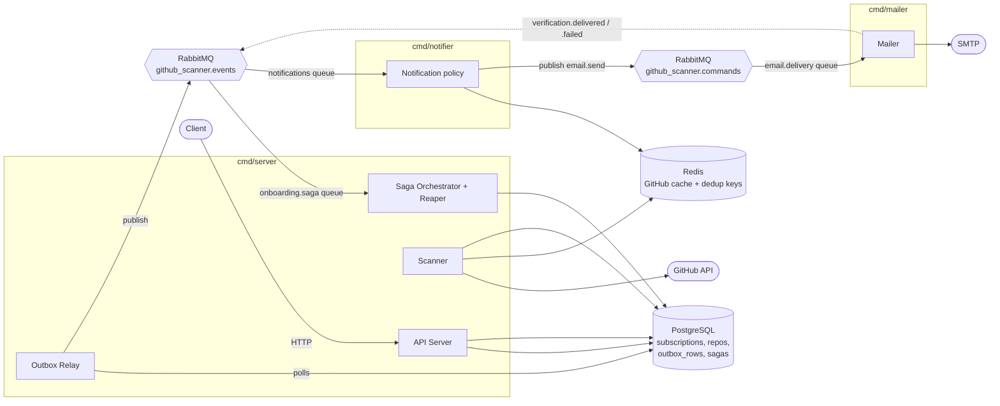
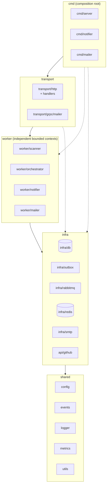
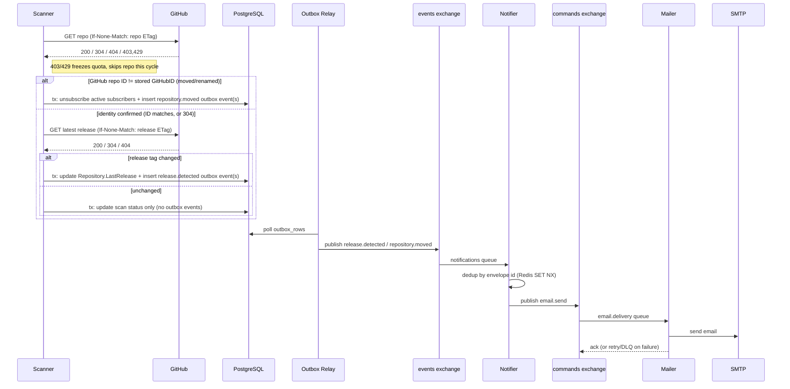
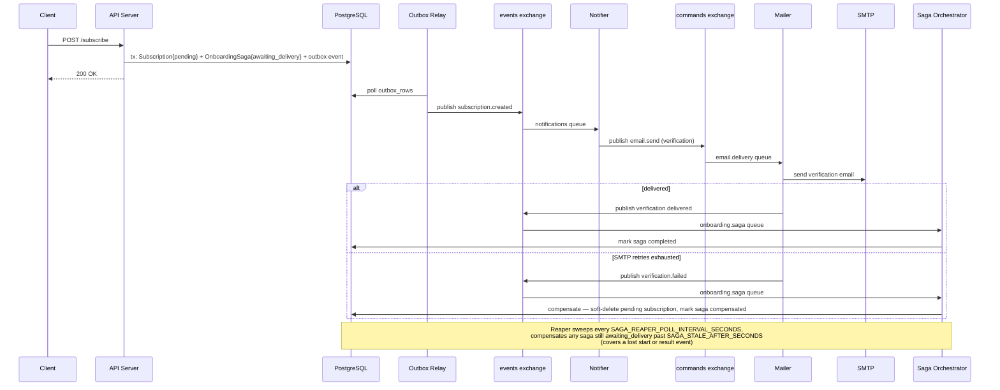

# Architecture diagrams

Companion to [`system_design.md`](system_design.md) (which has the prose FR/NFR
spec) and the [ADRs](adr/timeline.md) (which have the decision history). This
file only draws pictures; it does not re-argue any decision.

## 1. Components

Three independently deployable services share nothing but PostgreSQL (server
only), Redis (cache + dedup), and RabbitMQ (the only inter-service channel).

Notes:
- The **Outbox Relay** and **Saga Orchestrator** run as goroutines inside
  `cmd/server`, not separate binaries — see
  [ADR 006](adr/006_orchestrated_saga.md).
- The `notifier → mailer` hop can alternatively run over gRPC instead of the
  commands exchange (`NOTIFIER_DELIVERY_TRANSPORT=grpc`) — see
  [ADR 007](adr/007_grpc_mailer_transport.md). The diagram shows the default
  RabbitMQ path.

## 2. Layered dependency direction

Enforced by `internal/archtest` (`make test:unit`), not just documented. A
package may import its own layer or anything strictly below; never above.
Worker services are siblings, not a hierarchy — none of them may import
another (they only talk through the broker, per
[ADR 004](adr/004_modular_microservices.md)/[005](adr/005_rabbitmq_event_broker.md)).

`internal/archtest/layers_test.go` parses every non-test `.go` file's imports
and fails the build if any package imports something ranked above it, or if
one `internal/worker/<x>` package imports another.

## 3. Release notification flow

## 4. Subscription onboarding saga

